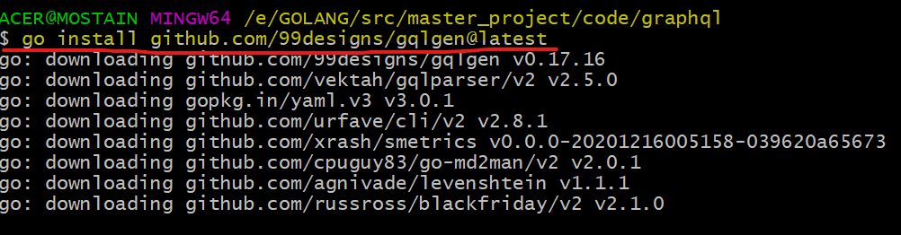
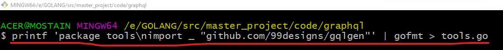
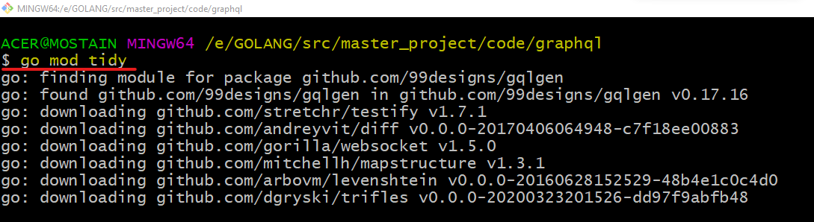
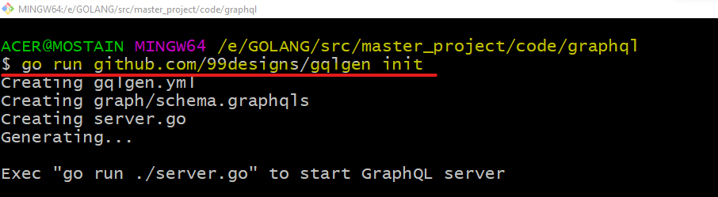
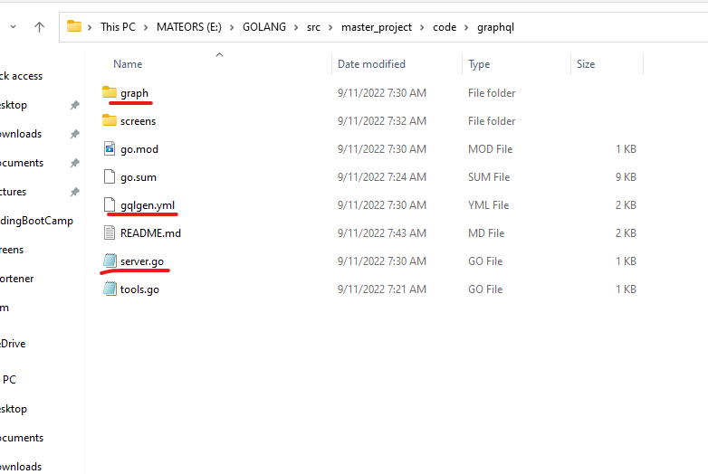
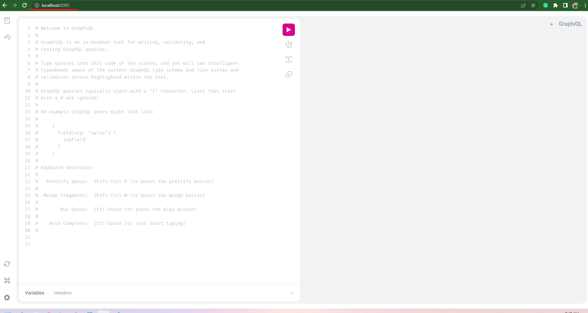
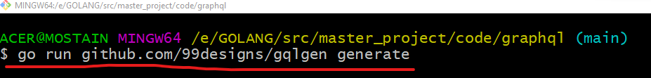
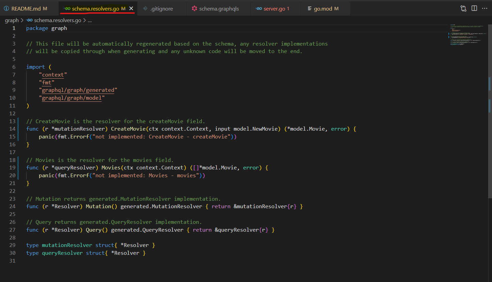

# GraphQL with couchbase database


## Why we choose gqlgen package ?
* gqlgen GraphQL Golang library is its schema-first approach.
* With gqlgen, you get automatic code generation for query and mutation resolvers based on your GraphQL schema.

## Step-1
> `go mod init graphql`

### Execute the following command to install the gqlgen library.
> `go install github.com/99designs/gqlgen@latest`



### Create a file called tools.go at the root of your project, where you will list all your dependencies
> `touch tools.go`

### Paste the following code snippet to tools.go file.
```go
package tools 

import _ "github.com/99designs/gqlgen"
```

> Windows user can use following code to do above steps at once.
`printf 'package tools\nimport _ "github.com/99designs/gqlgen"' | gofmt > tools.go`



### Open your terminal/command line program and execute the following command to add all missing dependencies.
> `go mod tidy`



### Create the Golang GraphQL project structure using the init command.
> `go run github.com/99designs/gqlgen init`



This command creates the project layout and files to run the GraphQL API. The `server.go` file is for running the GraphQL API, and the `schema.graphqls` contains some boilerplate schema definitions for the GraphQL API.

After successful execution of the above command you will have the following resource added into the project.
* directory -> graph
* file -> gqlgen.yml
* file -> server.go



### Run the project using the following command
> `go run server.go`



Open http://localhost:8080/ in your browser to test the GraphQL playground.

## Step-2 Define Your Graphql Schema
A GraphQL schema defines the data requirements that clients can request from the GraphQL API. In this next step, we will describe the GraphQL schema for our Movie API by modifying the schema. graphqls file.

Navigate to the `schema.graphqls` file and replace the contents with following code, defining the Query and Mutation schema for our Movie API.

```go
type Movie {
 id: ID!
 title: String!
 url: String!
 releaseDate: String!
}

type Query {
 movies: [Movie!]!
}

input NewMovie {
 title: String!
 url: String!
}

type Mutation {
 createMovie(input: NewMovie!): Movie!
}
```
The code above defines a `Query` and a `Mutation` type. The `Query` type retrieves all movies, and the Mutation type contains a `createMovie` method that takes in a new movie object as its input parameter.


## Step 3: Generate Your GraphQL Resolvers
GraphQL resolvers are functions that generate responses for a GraphQL query. The gqlgen library automatically generates resolvers based on the schema's defined `schema.graphqls` file, so you don't need to write the boilerplate code manually for generating resolvers.

* Navigate to the `schema.resolvers.go` file and delete the file's contents.
* Execute the following command to use the `gqlgen code generation feature` to `generate resolvers` based on your defined schema.

### Generate resolvers based on your schema.graphqls file
> `go run github.com/99designs/gqlgen generate`



The command above generates the skeleton of two GraphQL resolvers: one `Query` resolver function and one `Mutation` resolver function. The `createMovie` method will implement the movie creation logic, and the function `Movies` will contain the movie retrieval logic. Later in this tutorial, we will come back to implement the logic for these resolvers.



## Resource
* [Tutorial](https://hasura.io/blog/building-a-graphql-api-with-golang-postgres-and-hasura)
* [gqlgen](https://github.com/99designs/gqlgen)