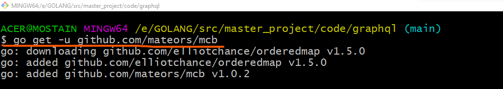
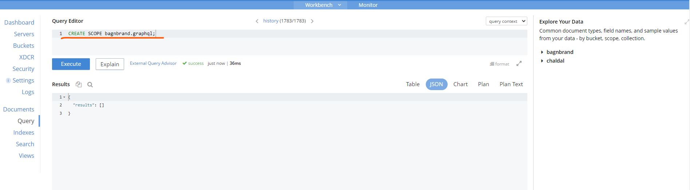
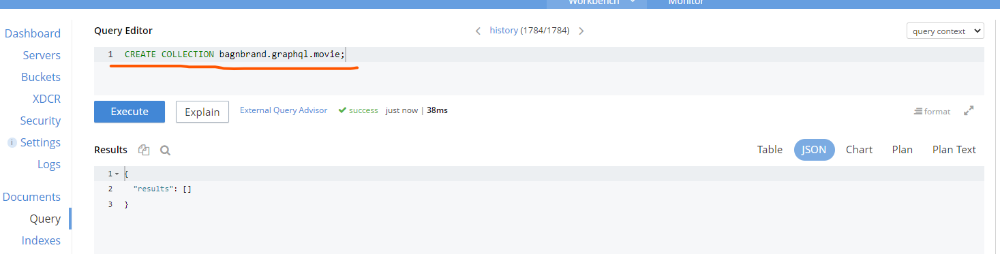
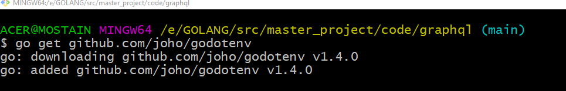

# GraphQL with couchbase database


## Why we choose gqlgen package ?
* gqlgen GraphQL Golang library is its schema-first approach.
* With gqlgen, you get automatic code generation for query and mutation resolvers based on your GraphQL schema.

## Step-1
> `go mod init graphql`

### Execute the following command to install the gqlgen library.
> `go install github.com/99designs/gqlgen@latest`


### Create a file called tools.go at the root of your project, where you will list all your dependencies
> `touch tools.go`

### Paste the following code snippet to tools.go file.
```go
package tools 

import _ "github.com/99designs/gqlgen"
```

> Windows user can use following code to do above steps at once.
`printf 'package tools\nimport _ "github.com/99designs/gqlgen"' | gofmt > tools.go`


### Open your terminal/command line program and execute the following command to add all missing dependencies.
> `go mod tidy`


### Create the Golang GraphQL project structure using the init command.
> `go run github.com/99designs/gqlgen init`


This command creates the project layout and files to run the GraphQL API. The `server.go` file is for running the GraphQL API, and the `schema.graphqls` contains some boilerplate schema definitions for the GraphQL API.

After successful execution of the above command you will have the following resource added into the project.
* directory -> graph
* file -> gqlgen.yml
* file -> server.go


### Run the project using the following command
> `go run server.go`


Open http://localhost:8080/ in your browser to test the GraphQL playground.

## Step-2 Define Your Graphql Schema
A GraphQL schema defines the data requirements that clients can request from the GraphQL API. In this next step, we will describe the GraphQL schema for our Movie API by modifying the schema. graphqls file.

Navigate to the `schema.graphqls` file and replace the contents with following code, defining the Query and Mutation schema for our Movie API.

```go
type Movie {
 id: ID!
 title: String!
 url: String!
 releaseDate: String!
}

type Query {
 movies: [Movie!]!
}

input NewMovie {
 title: String!
 url: String!
}

type Mutation {
 createMovie(input: NewMovie!): Movie!
}
```
The code above defines a `Query` and a `Mutation` type. The `Query` type retrieves all movies, and the Mutation type contains a `createMovie` method that takes in a new movie object as its input parameter.


## Step 3: Generate Your GraphQL Resolvers
GraphQL resolvers are functions that generate responses for a GraphQL query. The gqlgen library automatically generates resolvers based on the schema's defined `schema.graphqls` file, so you don't need to write the boilerplate code manually for generating resolvers.

* Navigate to the `schema.resolvers.go` file and delete the file's contents.
* Execute the following command to use the `gqlgen code generation feature` to `generate resolvers` based on your defined schema.

### Generate resolvers based on your schema.graphqls file
> `go run github.com/99designs/gqlgen generate`


The command above generates the skeleton of two GraphQL resolvers: one `Query` resolver function and one `Mutation` resolver function. The `createMovie` method will implement the movie creation logic, and the function `Movies` will contain the movie retrieval logic. Later in this tutorial, we will come back to implement the logic for these resolvers.


## Step 4: Provision Your Couchbase Database on localhost
We will be creating a NoSQL couchbase database on localhost to store data for our movie application.

### Install couchbase database driver package
> `go get -u github.com/mateors/mcb`



Couchbase is a flexible nosql database supports no schema, so we do not need to create any predefined schema for our project, we will use the `schema.graphqls` file model instead to create a `collection` called `movie` where all our movie will be stored.

### Database credentials
* Host : `localhost`
* Username: `mateors`
* Password `Test123@`
* Bucket: `bagnbrand`
* Scope: `graphql`
* Collection: `movie`

#### Database Scope creation
> `CREATE SCOPE bagnbrand.graphql;`


#### Database Collection creation
> `CREATE COLLECTION bagnbrand.graphql.movie;`



## Step 5: Connect Your Couchbase Database to Golang
We'll use the `Database credentials` we mentioned above to connect our Couchbase database to the Golang project in this step.

### Create an a `.env` file in the root of your project folder and paste the Couchbase `Database credentials` as shown below.
```go
HOST=localhost
DBUSER=mateors
DBPASS=Test123@
BUCKET=bagnbrand
SCOPE=graphql
COLLECTION=movie
```

> `go get github.com/joho/godotenv`


We need a database driver to connect to the couchbase database, we already installed mcb package for that. godotenv is a Golang package that allows you to load environment credentials from an a.env file into your app.

### Open your terminal and execute the tidy command to add any other missing dependencies.
> `go mod tidy`

### In the graph project folder, create a `db.go` file and paste the following code block.
```go
package graph

import (
	"os"

	"github.com/mateors/mcb"
)

func Connect() *mcb.DB {

	host := os.Getenv("HOST")
	username := os.Getenv("USERNAME")
	password := os.Getenv("PASSWORD")
	//bucket := os.Getenv("BUCKET")
	//scope := os.Getenv("SCOPE")

	db := mcb.Connect(host, username, password, false)
	res, err := db.Ping()
	if err != nil {
		panic(res)
	}
	return db
}
```
The above code block defines a function that connects to the couchbase database using the `database credentials` specified in the environment variable.

We will set up this connection in our `server.go` file to establish a link to the Couchbase database as the server starts.


### Modify the contents of the server.go file using the code snippets below.
```go
package main

import (
	"graphql/graph"
	"graphql/graph/generated"
	"log"
	"net/http"
	"os"
	"github.com/99designs/gqlgen/graphql/handler"
	"github.com/99designs/gqlgen/graphql/playground"
	"github.com/joho/godotenv"
)

const defaultPort = "8080"
var bucketName string
var scopeName string

func init() {

	err := godotenv.Load()
	if err != nil {
		log.Fatal("Error loading .env file")
	}
	bucketName = os.Getenv("BUCKET")
	scopeName = os.Getenv("SCOPE")
}

func main() {

	db := graph.Connect()
	srv := handler.NewDefaultServer(generated.NewExecutableSchema(generated.Config{Resolvers: &graph.Resolver{DB: db}}))

	port := os.Getenv("PORT")
	if port == "" {
		port = defaultPort
	}
	http.Handle("/", playground.Handler("GraphQL playground", "/query"))
	http.Handle("/query", srv)
	log.Printf("connect to http://localhost:%s/ for GraphQL playground", port)
	log.Fatal(http.ListenAndServe(":"+port, nil))
}
```
The above code block calls the Connect function in the db.go file and stores that connection within the Resolver struct

#### In the graph folder, navigate to the resolver.go file to add the DB connection field in the Resolver struct as a dependency.

```go
package graph

import "github.com/mateors/mcb"

type Resolver struct {
	DB *mcb.DB
}
```
We have successfully configured our Couchbase database in our Golang project. In the next step, we will be implementing our resolver functions.


## Step-6: Implement Your Generated Resolvers
This step will implement the logic for the resolver methods in the `schema.resolvers.go` file.

#### Paste the following code snippet in the createMovie function; 
#### it takes in the movie object as input and inserts it into the Couchbase database.

```go
// schema.resolvers.go
func (r *mutationResolver) CreateMovie(ctx context.Context, input model.NewMovie) (*model.Movie, error) {

	movie := model.Movie{
		Title: input.Title,
		URL:   input.URL,
	}
	docId := fmt.Sprintf("101_%v", movie.ID)
	mres := r.DB.InsertIntoBucket(docId, "bagnbrand.graphql.movie", &movie)
	if mres.Status != "success" {
		return nil, fmt.Errorf("%+v", mres.Errors)
	}
	return &movie, nil
}
```
#### Paste the following code snippet in the Movies function. 
#### The function retrieves a collection of movies from the Postgres database based on the defined movie model.

```go
// Movies is the resolver for the movies field.
func (r *queryResolver) Movies(ctx context.Context) ([]*model.Movie, error) {

	var movies []*model.Movie
	mres := r.DB.Query("SELECT id,title,url,releaseDate FROM bagnbrand.graphql.movie;")
	if mres.Status != "success" {
		return nil, fmt.Errorf("%+v", mres.Errors)
	}
	rows := mres.GetRows()
	for _, row := range rows {
		var movie = &model.Movie{}
		movie.ID = fmt.Sprint(row["id"])
		movie.ReleaseDate = fmt.Sprint(row["releaseDate"])
		movie.Title = fmt.Sprint(row["title"])
		movie.URL = fmt.Sprint(row["url"])
		movies = append(movies, movie)
	}
	return movies, nil
}
```
Now that we have successfully connected our Couchbase database and set up our resolvers, we can test the project.

## Resource
* [Tutorial](https://hasura.io/blog/building-a-graphql-api-with-golang-postgres-and-hasura)
* [gqlgen](https://github.com/99designs/gqlgen)